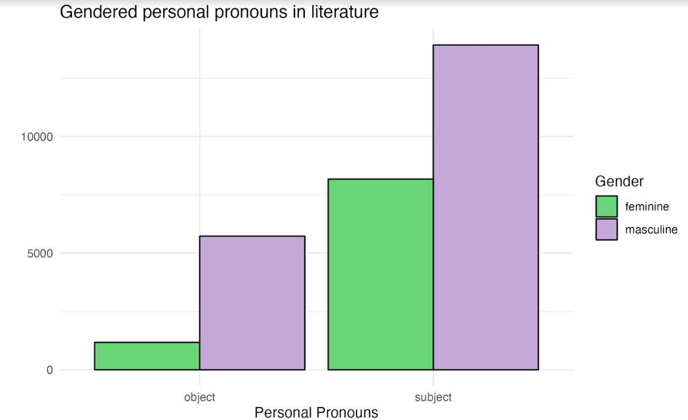

# NLP Project
### Brittany Fisher and Jordyn Irwin

## Introduction

The interaction between language and culture is long-studied and researchers have not come to a clear consensus on the nature of that interaction. Linguists are intrigued by the differences in languages since it is common for one language to have a word without an exact translation in another. Sedivy’s Language in Mind offers the example: English has words like responsibility, accountability, guilt, and liability, but Italian just has the word responsibilitá which encompasses all of those (2014, p. 493). This begs the question– does language influence culture or does culture influence language? 

The Whorf hypothesis posits “that a language’s inventory of words has an effect on how its speakers think about or perceive the world” (Sedivy, 2014, p. 498). The strict form of this theory has been largely discredited by linguists via research studies; however, the inverse–that only culture affects language–is not necessarily correct either. 

In research studying this, there seems to be something of a selective nature to Whorfian effects. English speakers tend to emphasize how a motion was conducted such as “Kim walked into the house” whereas in Spanish or Greek there is an emphasis on the path of the motion such as “Kim entró en la casa” or “Kim entered the house” (Sedivy, 2014, p. 506). Anna Papafragou and colleagues conducted a study regarding this by tracking eye movements of English and Greek when they watched a video of a boy skateboarding into a net. When told they would be asked to verbally describe the video after watching, there was a difference in eye movements. English speakers focused on the manner (skateboarding) while Greek speakers focused on where the path ended (the net). Yet, if just asked to remember the video for a memory test, the difference in eye movement vanished (Sedivy, 2014, pp. 506-507). Essentially, how the people interacted with an event depended on if language was activated.

As Sedivy writes, “Clearly, language is entangled with culture.” (Sedivy, 2014, p. 516). With this in mind, in a situation where language is inherently included like writing a novel, it’s logical to wonder how language and cultural beliefs about gender interact.

Gendered Lives explores how language often reveals a cultural understanding of gender. Wood (2013) writes “Language also reflects social views of women as passive and men as active” (p. 120) and that language used in reference to women typically highlights “their relationship with others rather than as independent nature (Wood, 2013, p. 121).   

The English language offers an interesting opportunity to explore the mesh of language and culture due to how grammar governs pronouns. There are five types of pronouns-- subject pronouns, object pronouns, possessive adjectives, possessive pronouns, and reflexive pronouns. In a sentence, subject pronouns perform the actions whereas object pronouns receive said actions. For example, in the sentences "I drove her to the store." or "She grew annoyed at them in traffic.", 'I' and 'She' are subject pronouns while 'her' and 'them' are the object pronouns. 

Not only could language reflect culture and vice versa, but the way a particular gender uses language could also display that cultural context. Gendered communication refers to the different features of language when someone who was socialized in feminine speech in contrast to someone who was socialized in masculine speech. Feminine speech is used to “foster connections, support closeness, and for understanding.” (Wood, 2013, p. 128). Masculine speech is used to “accomplish concrete goals, exert control, [and] preserve independence” (Wood, 2013, p. 131). 

Novels offer a rich dataset to examine that combination of language and culture. Do these tendencies show implicitly in the way authors write? Are masculine subject pronouns more commonly used than feminine object pronouns thereby mirroring those stereotypes? Does the gender of the author affect the phenomenon?


## Methodology
Eleven books were retrieved from Gutenberg.org and copied into a designated Github repository to facilitate their use in analysis. Utilizing Spark NLP to tokenize the words in eleven text documents, the words were tagged with a part-of-speech tagger. The full results of the entire text file for each book were then queried for pronouns (she, her, hers, he, him, his) using pyspark.sql functions. This resulted in a table with three columns: word, part of speech (pos), and count. The results from these queries were then used to perform statistical analysis to determine whether significant differences exist between the proportional occurrences of subject and object pronouns for masculine and feminine pronouns within this set of texts. For clarity, the part-of-speech tagger codes to possessive adjectives as PRP$ which is defined as ‘possessive pronoun’. This definition will be used going forward.

The dataset includes the novels The Jungle by Upton Sinclair, Frankenstein by Mary Shelley, Little Women by Louisa M. Alcott, Wuthering Heights by Emily Brontë, Alice's Adventures in Wonderland by Lewis Carroll, The Castle of Otranto by Horace Walpole, At Fault by Kate Chopin, Down the Slope by James Otis, Fantasy: A Novel by Matilde Serao, Moby Dick by Herman Melville, and Skyrider by B.M Bower. These were chosen via the random function on Gutenberg.org; however, it is not a truly random sample since they were filtered to include novels written by women and include novels with a male protagonist written by a woman and a female protagonist written by a man. 


## Hypothesis
1. The proportion of masculine subject pronouns will be higher than the proportion of feminine subject pronouns. 
2. In books written by a female author, the pronoun type usage will be more even.

## Evaluation

For all books, the proportion of feminine subject pronouns is statistically greater than the proportion of masculine subject pronouns. P-value = <2.2e-16
In novels written by female authors, the proportion of feminine subject pronouns is statistically greater than the proportion of masculine subject pronouns. P-value = <2.2e-16.
In novels written by male authors, the proportion of feminine subject pronouns is statistically greater than the proportion of masculine subject pronouns. P-value = <2.2e-16.
All proportions are roughly equal. For all authors, 0.87 of feminine personal pronouns are subject and 0.71 of masculine pronouns are subject. For just male authors, 0.88 of feminine personal pronouns are subject and 0.70 of masculine pronouns are subject. For just female authors, 0.87 of feminine personal pronouns are subject and 0.72 of masculine pronouns are subject.
The results show that not only are the proportions of these groups not equal, but the outcome is the opposite of our hypotheses. 
However, there is a crucial caveat. The natural language processing algorithm that identifies part of speech is not accurate. The feminine object personal pronoun (“her”) is the same as the feminine possessive pronoun (“her”). In contrast, the masculine object personal pronoun (“him) is not the same as the masculine possessive pronoun (“his”). The algorithm repeatedly fails to identify “her” as an object personal pronoun when it should. For example, in Down the Slope by James Otis, the algorithm identified 28 out of 29 uses of “her” as a possessive pronoun and only one use object personal pronoun. In actuality, 17 out of 29 uses of “her” are possessive pronouns and 12 out of 29 uses of “her” are object personal pronouns. 
In a less effecting issue, the algorithm also has issues identifying “Him” with a capital ‘H’ as a title rather than a pronoun. It is common to refer to a higher power as “Him” as found in Little Women four times and Moby Dick at least once. 

Below is the code for the language processing:

```{python}
!wget http://setup.johnsnowlabs.com/colab.sh -O - | bash

import sparknlp
spark = sparknlp.start()
from sparknlp.annotator import Tokenizer
from sparknlp.base import DocumentAssembler
from pyspark.ml import Pipeline
from sparknlp.annotator import *
from sparknlp.pretrained import PretrainedPipeline

pipeline = PretrainedPipeline("explain_document_ml")

from pyspark.sql import SparkSession

# Initialize Spark session
spark = SparkSession.builder \
    .appName("SparkNLPExample") \
    .getOrCreate()

# Step 1: Transform raw text to `document` annotation
document_assembler = (
      DocumentAssembler()
      .setInputCol("text")
      .setOutputCol("document")
)

# Step 2: Tokenization
tokenizer = Tokenizer().setInputCols(["document"]).setOutputCol("token")

# Step 3: Perceptron model for POS Tagger

postagger = (
    PerceptronModel.pretrained("pos_anc", "en")
    .setInputCols("document", "token")
    .setOutputCol("pos")
)

# Define the pipeline object
pos_pipeline = Pipeline(stages = [
      document_assembler,
      tokenizer,
      postagger
])

# Get all books

# Example: The Jungle
!curl "https://raw.githubusercontent.com/brittanysfisher/books/main/The%20Jungle.txt" -o jungle.txt
jungle = open('jungle.txt').read()

# Add text to a Spark Data Frame - change to desired text
text = spark.createDataFrame([[jungle]], ["text"])

# Fit text to pipeline
result = pos_pipeline.fit(text).transform(text)
result.show()

from pyspark.sql import functions as F
from pyspark.sql.functions import col

# Query for feminine pronouns
result.select(        
        F.explode( # create zipped array from "result" of token and pos, and explode this result into separate token and pos columns
            F.arrays_zip(
                result.token.result,
                result.pos.result
            )
        ).alias("cols")
    ).select( # select resulting columns from previous step and give them aliases
        F.expr("cols['0']").alias("word"),
        F.expr("cols['1']").alias("pos")
    ).filter( # filter to feminine pronouns
        col("word").isin("She", "she", "Her", "her", "Hers", "hers")
    ).groupBy( # group by word and pos, as a word could potentially be tagged with different pos
        "word", "pos"
    ).count().show(truncate=False) # count occurrences of each word and pos combination


# Query for masculine pronouns
result.select(
        F.explode(
            F.arrays_zip(
                result.token.result,
                result.pos.result
            )
        ).alias("cols")
    ).select(
        F.expr("cols['0']").alias("word"),
        F.expr("cols['1']").alias("pos")
    ).filter(
        col("word").isin("He", "he", "Him", "him", "His", "his")
    ).groupBy(
        "word", "pos"
    ).count().show(truncate=False)

```

Below is the R code used to perform 2-proportion z-tests:

```{r}
# All authors
x_m = 13920
n_m = 19648
x_f = 8174
n_f = 9348

prop.test(x=c(x_m,x_f), n=c(n_m,n_f), alternative = "less")

# p-value < 2.2e-16
```

```{r}
# Female authors

x_m = 7404
n_m = 10350
x_f = 6513
n_f = 7471

prop.test(x=c(x_m,x_f), n=c(n_m,n_f), alternative = "less")

# p-value < 2.2e-16
```

```{r}
# Male authors

x_m = 6516
n_m = 9249
x_f = 1661
n_f = 1877

prop.test(x=c(x_m,x_f), n=c(n_m,n_f), alternative = "less")

# p-value < 2.2e-16
```


The following is the code used to generate the data visualization for our results:

```{r}
# Create data frame
data = data.frame(gender = c("masculine","masculine", "feminine", "feminine"), pronoun = c("subject", "object", "subject", "object"), count = c(13920, 5728, 8174, 1174))

# Into tibble
as_tibble(data)

# Into factors
ds=data %>%
  mutate(pronoun = as.factor(pronoun),
         gender = as.factor(gender))

# Data Viz
ds %>%
  ggplot(aes(pronoun, count, fill=gender))+
  geom_col(position = "dodge", color="black")+
  theme_minimal()+
  labs (title = "Gendered personal pronouns in literature", y = "", x = "Personal Pronouns", legend = "Gender")+
  scale_fill_brewer(palette= "Accent", name = "Gender")
```




Below are the results from the part-of-speech tagger.

1. The Jungle by Upton Sinclair


| word | pos  | count |
|------|------|-------|
| she  | PRP  | 625   |
| She  | PRP  | 131   |
| her  | PRP$ | 634   |
| hers | NNS  | 2     |
| her  | PRP  | 103   |
| Her  | PRP$ | 13    |


| word | pos  | count |
|------|------|-------|
| his  | PRP$ | 1620  |
| He   | PRP  | 549   |
| His  | PRP$ | 46    |
| him  | PRP  | 1136  |
| he   | PRP  | 2639  |


2. Frankenstein by Mary Shelley


| word | pos  | count |
|------|------|-------|
| she  | PRP  | 181   |
| She  | PRP  | 68    |
| her  | PRP$ | 323   |
| hers | NNS  | 2     |
| her  | PRP  | 33    |
| Her  | PRP$ | 15    |
| hers | VBZ  | 1     |


| word | pos  | count |
|------|------|-------|
| his  | PRP$ | 500   |
| He   | PRP  | 127   |
| His  | PRP$ | 33    |
| him  | PRP  | 220   |
| he   | PRP  | 471   |


3. Little Women by Louisa M. Alcott


| word | pos  | count |
|------|------|-------|
| she  | PRP  | 1958  |
| She  | PRP  | 294   |
| her  | PRP$ | 2837  |
| hers | PRP  | 2     |
| hers | NNS  | 11    |
| her  | PRP  | 323   |
| Her  | PRP$ | 51    |


| word | pos  | count |
|------|------|-------|
| his  | PRP$ | 1095  |
| Him  | PRP  | 3     |
| He   | PRP  | 211   |
| His  | PRP$ | 20    |
| him  | PRP  | 735   |
| he   | PRP  | 1262  |


4. Wuthering Heights by Emily Brontë


| word | pos  | count |
|------|------|-------|
| she  | PRP  | 1079  |
| She  | PRP  | 154   |
| her  | PRP$ | 1300  |
| hers | PRP  | 1     |
| hers | NNS  | 13    |
| her  | PRP  | 181   |
| Her  | PRP$ | 34    |


| word | pos  | count |
|------|------|-------|
| his  | PRP$ | 1373  |
| Him  | PRP  | 1     |
| He   | PRP  | 317   |
| His  | PRP$ | 37    |
| him  | PRP  | 857   |
| he   | PRP  | 1550  |


5. Alice's Adventures in Wonderland by Lewis Carroll


| word | pos  | count |
|------|------|-------|
| she  | PRP  | 498   |
| She  | PRP  | 33    |
| her  | PRP$ | 215   |
| hers | PRP  | 2     |
| hers | NNS  | 1     |
| her  | PRP  | 28    |
| Her  | PRP$ | 3     |


| word | pos  | count |
|------|------|-------|
| his  | PRP$ | 93    |
| Him  | PRP  | 1     |
| He   | PRP  | 15    |
| His  | PRP$ | 1     |
| him  | PRP  | 37    |
| he   | PRP  | 94    |


6. The Castle of Otranto by Horace Walpole


| word | pos  | count |
|------|------|-------|
| she  | PRP  | 241   |
| She  | PRP  | 34    |
| her  | PRP$ | 327   |
| her  | PRP  | 57    |
| Her  | PRP$ | 11    |


| word | pos  | count |
|------|------|-------|
| his  | PRP$ | 475   |
| He   | PRP  | 76    |
| His  | PRP$ | 12    |
| him  | PRP  | 186   |
| he   | PRP  | 431   |


7. At Fault by Kate Chopin

| chunk | pos  | count |
|-------|------|-------|
| she   | PRP  | 598   |
| She   | PRP  | 162   |
| her   | PRP$ | 800   |
| Hers  | NNP  | 2     |
| hers  | NNS  | 6     |
| her   | PRP  | 138   |
| Her   | PRP$ | 22    |


| chunk | pos  | count |
|-------|------|-------|
| his   | PRP$ | 586   |
| Him   | PRP  | 2     |
| He    | PRP  | 180   |
| His   | PRP$ | 27    |
| him   | PRP  | 343   |
| he    | PRP  | 711   |


8. Down the Slope by James Otis

| chunk | pos  | count |
|-------|------|-------|
| she   | PRP  | 18    |
| She   | PRP  | 1     |
| her   | PRP$ | 28    |
| her   | PRP  | 1     |


| chunk | pos  | count |
|-------|------|-------|
| his   | PRP$ | 538   |
| He    | PRP  | 88    |
| His   | PRP$ | 11    |
| him   | PRP  | 362   |
| he    | PRP  | 909   |


9. Fantasy: A Novel by Matilde Serao

| chunk | pos  | count |
|-------|------|-------|
| she   | PRP  | 968   |
| She   | PRP  | 426   |
| her   | PRP$ | 1618  |
| hers  | PRP  | 4     |
| hers  | NNS  | 9     |
| her   | PRP  | 218   |
| Her   | PRP$ | 55    |


| chunk | pos  | count |
|-------|------|-------|
| his   | PRP$ | 810   |
| Him   | PRP  | 3     |
| He    | PRP  | 304   |
| His   | PRP$ | 37    |
| him   | PRP  | 388   |
| he    | PRP  | 795   |


10. Moby Dick by Herman Melville

| chunk | pos  | count |
|-------|------|-------|
| she   | PRP  | 100   |
| She   | PRP  | 14    |
| her   | PRP$ | 291   |
| her   | PRP  | 27    |
| Her   | PRP$ | 3     |


| chunk | pos  | count |
|-------|------|-------|
| his   | PRP$ | 2457  |
| Him   | PRP  | 5     |
| He    | PRP  | 188   |
| His   | PRP$ | 55    |
| him   | PRP  | 1005  |
| he    | PRP  | 1527  |


11. Skyrider by B.M Bower 

| chunk | pos  | count |
|-------|------|-------|
| she   | PRP  | 441   |
| She   | PRP  | 184   |
| her   | PRP$ | 404   |
| hers  | PRP  | 3     |
| hers  | NNS  | 1     |
| her   | PRP  | 65    |
| Her   | PRP$ | 12    |


| chunk | pos  | count |
|-------|------|-------|
| his   | PRP$ | 826   |
| Him   | PRP  | 1     |
| He    | PRP  | 431   |
| His   | PRP$ | 40    |
| him   | PRP  | 443   |
| he    | PRP  | 1045  |


## Conclusion

While on face value, the data shows strong evidence that the proportion of feminine subject personal pronouns is greater compared to the proportion of masculine subject personal pronouns. Additionally, the authorial gendered effect on the outcome also favors feminine subject personal pronouns. Yet, due to the inaccuracy of the part-of-speech tagger, the results are inconclusive and more research will be required. To move forward, either the part-of-speech tagger must be improved or tagging will need to be done manually. 

This is a perfect example of three important facets of data science. First, machine learning algorithms should always be questioned and verified. They are useful and could potentially be a crucial tool in data science, yet they are not the end-all-be-all. At this time, Chat-GPT4 might tell you that 9.11 is a larger number than 9.9 (this is real!). Question everything. 

This leads to the second, critical thinking about data accuracy is key. Spark did not send an error alerting the incorrect part-of-speech tags because it found “Her” as a subject personal pronoun and “her” as a possessive pronoun to be indistinguishable. Looking at the results and taking the logical leap that 28 uses of feminine possessive pronouns with only 1 use of feminine subject personal pronouns just seemed wrong was the error alert. However, it could have just as easily been a data error when importing the text of the novel which is why checking your results no matter the tool is essential.

Third, in conjunction with critical thinking, is that cultural context matters. The part-of-speech tagger is a great example of the ambiguity inherent to language that machine learning scientists haven’t yet figured out. The incorrect tagging leading to “Him” to be conflated with “him” comes from both the absence of cultural context of religion alongside the grammatical context of the surrounding language.

Despite the errors of data science, the original question remains. Can the cultural views surrounding gender be found in the language of literature? Does socialization go further by even showing differences by the gender of the author? It won’t be answered yet, but the potential continues. It could be answered with a more sophisticated natural language processor soon enough.

### References

Sedivy, J. (2014). Language in Mind. 
Wood, J. T. (2013). Gendered Lives. 
